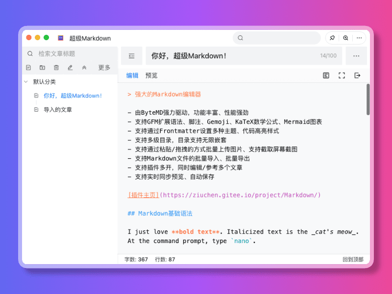
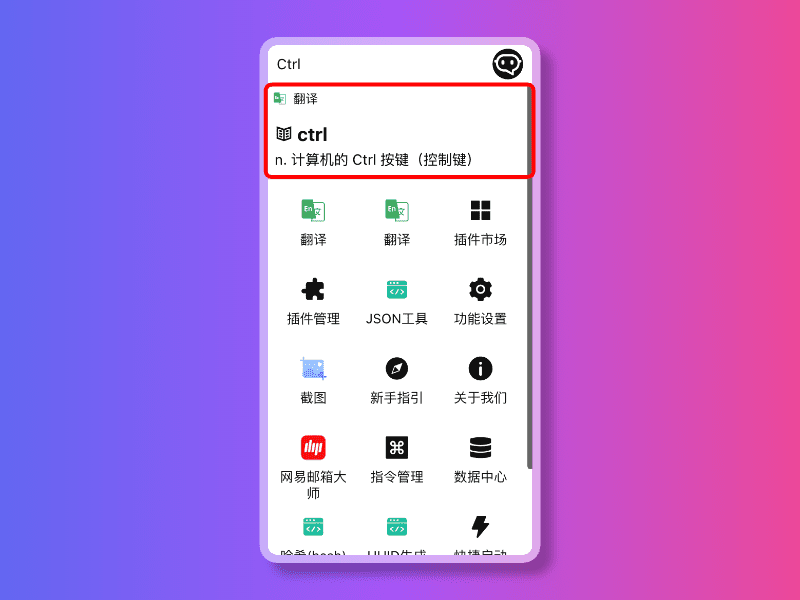
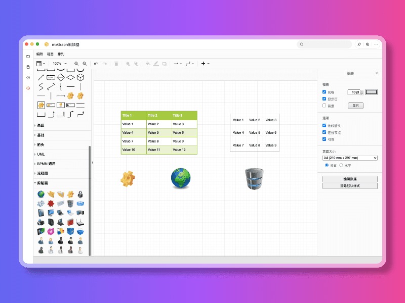

# FocusAny


`FocusAny` 是一个桌面工具条系统，支持市场插件、本地插件的一键启动，快速扩展功能，提高工作效率。

## 功能特性

- 功能设置：呼出快捷键设置、开机启动
- 插件管理：支持插件安装、卸载、启用、禁用等操作
- 指令管理：支持内置和插件指令快速一览和启用、禁用、打开等操作
- 文件快速启动：支持文件快速启动，快速抵达目标文件
- 快捷键启动：支持全局快捷键启动，快速启动软件
- 数据中心：支持文件导出同步、WebDav文件同步
- 暗黑模式：支持暗黑模式，保护眼睛

## 插件支持一览

<table width="100%">
    <tbody>
        <tr>
            <td colspan="2">插件市场</td>
        </tr>
        <tr>
            <td colspan="2">
                
            </td>
        </tr>
        <tr>
            <td width="50%">Markdown插件</td>
            <td>Ctool程序员工具箱</td>
        </tr>
        <tr>
            <td>
                
            </td>
            <td>
                
            </td>
        </tr>
        <tr>
            <td>翻译插件</td>
            <td>剪切板插件</td>
        </tr>
        <tr>
            <td>
                
            </td>
            <td>
                
            </td>
        </tr>
        <tr>
            <td>脑图编辑器</td>
            <td>mxGraph编辑器</td>
        </tr>
        <tr>
            <td>
                
            </td>
            <td>
                
            </td>
        </tr>
        <tr>
            <td>tldraw白板</td>
            <td>Excalidraw白板</td>
        </tr>
        <tr>
            <td>
                
            </td>
            <td>
                
            </td>
        </tr>
        <tr>
            <td>密码管理器</td>
            <td>图片美化</td>
        </tr>
        <tr>
            <td>
                
            </td>
            <td>
                
            </td>
        </tr>
        <tr>
            <td>OTP两步验证</td>
            <td>截图与贴图</td>
        </tr>
        <tr>
            <td>
                
            </td>
            <td>
                
            </td>
        </tr>
    </tbody>
</table>

`FocusAny` 还支持持续支持更多的功能扩展，让你通过插件的方式，实现更多的功能。

## 安装使用

- 访问 [https://focusany.com](https://focusany.com) 下载 对应系统 安装包，一键安装即可

## 技术栈

- `electron`
- `vue3`
- `typescript`

## 本地运行开发

> 仅在 node 20 测试过

```shell
# 安装依赖
npm install
# 调试运行
npm run dev
# 打包
npm run build
```

## 加入交流群

<table width="100%">
    <thead>
        <tr>
            <th width="50%">微信群</th>
            <th>QQ群</th>
        </tr>
    </thead>
    <tbody>
        <tr>
            <td>
                
            </td>
            <td>
                
            </td>
        </tr>
    </tbody>
</table>

## 本程序中使用到了以下开源项目，特此感谢

- Electron
- Vue3
- TypeScript

## License

AGPL-3.0
